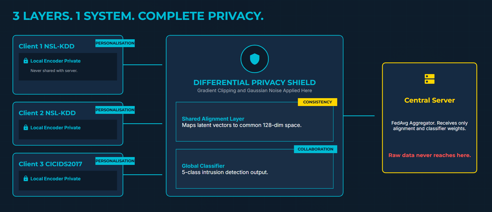
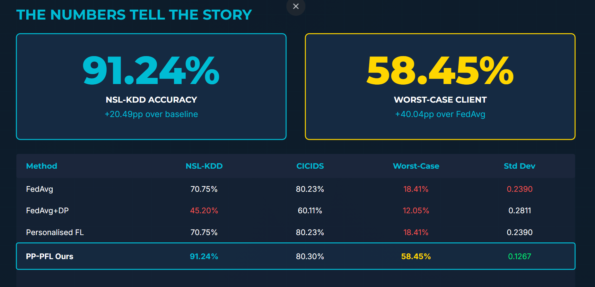
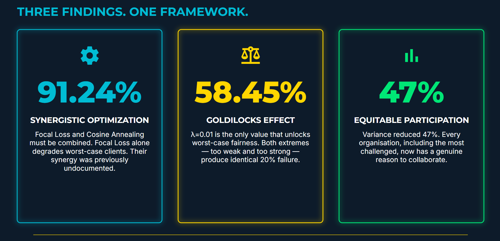
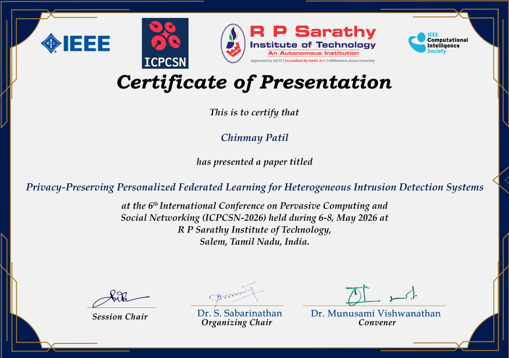

# 🚀 FedIDS — Privacy-Preserving Personalized Federated Learning for Intrusion Detection Systems

> IEEE Conference Accepted Research Project — ICPCSN 2026  
> Privacy-Preserving AI · Federated Learning · Cybersecurity · Fairness-Aware ML

---

## 📌 Overview

FedIDS is a research-driven Personalized Federated Learning framework designed for real-world Intrusion Detection Systems (IDS) operating under heterogeneous Non-IID environments.

Traditional intrusion detection systems rely on centralized network traffic aggregation, creating severe privacy, scalability, and regulatory concerns. Standard Federated Learning approaches such as FedAvg partially solve privacy issues but fail under realistic heterogeneous client distributions — causing catastrophic degradation for weaker clients.

FedIDS addresses this challenge through a fairness-aware Privacy-Preserving Personalized Federated Learning (PP-PFL) architecture combining:

- Personalized client encoders
- Shared alignment layers
- Differential Privacy (DP-SGD)
- Focal Loss optimization
- Cosine Annealing learning rate scheduling

The framework enables collaborative intrusion detection without raw data sharing while maintaining robustness, stability, fairness, and privacy across heterogeneous clients.

---

# 🏆 Research Highlights

- 📄 Accepted at **ICPCSN 2026** (IEEE-indexed International Conference)
- 📈 Achieved **91.24% NSL-KDD accuracy**
- ⚖️ Improved worst-case client performance from **18.41% → 58.45%**
- 📉 Reduced client variance by **47%**
- 🔒 Differential Privacy integration with stable convergence
- ⚡ Constant communication overhead (~70KB/client)

---

# 🖼️ Research Showcase

## System Architecture



---

## Experimental Results



---

## Key Findings



---

## IEEE Conference Acceptance



---

# 🔬 Research Contribution

This work focuses not only on improving global accuracy, but on improving fairness across federated clients under severe Non-IID conditions.

The core research contribution is the discovery that:

- Focal Loss alone harms worst-case federated clients
- Cosine Annealing stabilizes this optimization instability
- Their synergy dramatically improves both fairness and convergence

Additionally, the work introduces:

- Alignment-layer-based heterogeneous representation mapping
- Fairness-oriented evaluation using worst-case client metrics
- The “Goldilocks Effect” in personalization regularization strength (λ)

These findings directly address practical deployment challenges in collaborative cybersecurity systems.

---

# 🏗️ System Architecture

The framework separates:

- Local client encoders (private)
- Shared alignment layer
- Global classifier
- Federated aggregation via FedAvg
- Differential Privacy applied to shared parameters only

This design preserves privacy while enabling collaborative attack pattern learning across heterogeneous environments.

---

# 🧪 Experimental Setup

## Datasets
- NSL-KDD
- CICIDS2017

## Learning Paradigms
- Federated Averaging (FedAvg)
- Personalized Federated Learning (PFL)

## Data Distributions
- IID
- Non-IID (label-skewed client partitions)

## Privacy Budgets
- ε = 0
- ε = 1
- ε = 2
- ε = 5

## Evaluation Metrics
- Accuracy
- Macro F1-score
- Worst-case client accuracy
- Variance across clients
- False Positive Rate (FPR)
- Communication Cost
- Inference Latency
- Privacy–Utility Tradeoff

---

# 📊 Key Findings

- FedAvg performs well only under IID and non-private settings
- FedAvg becomes unstable under Non-IID data and strong privacy constraints
- Personalized FL maintains stable convergence under heterogeneous distributions
- Differential Privacy introduces a graceful privacy–utility tradeoff
- Communication overhead remains nearly constant across ε values
- Fairness-aware optimization significantly improves weaker clients

---

# 🛠️ Tech Stack

- Python
- PyTorch
- Federated Learning
- Differential Privacy (DP-SGD)
- Personalized Federated Learning (PFL)
- Cybersecurity / Intrusion Detection Systems
- Non-IID Distributed Learning
- Data Visualization (Matplotlib)

---

# ⚙️ Installation

```bash
pip install -r requirements.txt
```

---

# ▶️ Running Experiments

## Baseline Federated Averaging

```bash
python main.py --rounds 20 --epsilon 0 --iid
python main.py --rounds 20 --epsilon 2 --noniid
```

---

## Personalized Federated Learning

```bash
python personalized_fl.py --rounds 20 --epsilon 1 --iid
python personalized_fl.py --rounds 20 --epsilon 5 --noniid
```

---

# 📈 Generate Visualizations

```bash
python generate_graphs.py
```

Generated graphs are saved inside the `graphs/` directory.

---

# 🏗️ Project Structure

```bash
FedIDS/
├── federated_client.py        # Local client training
├── federated_server.py        # Server aggregation
├── personalized_fl.py         # Personalized FL pipeline
├── privacy.py                 # Differential Privacy mechanisms
├── preprocessing.py           # Dataset preprocessing
├── metrics.py                 # Evaluation metrics
├── generate_graphs.py         # Visualization generation
├── main.py                    # FedAvg baseline experiments
├── graphs/                    # Experimental graphs
├── results/                   # Saved experiment outputs
├── images/                    # README visual assets
├── requirements.txt
└── README.md
```

---

# 🔁 Reproducibility

- Deterministic data partitioning
- Dependency versions specified
- Experimental settings documented
- Results correspond to reported paper findings
- Datasets excluded due to licensing restrictions

---

# 📌 Why This Project Matters

In real-world federated cybersecurity systems:

- Organizations cannot share raw traffic data
- Clients operate under highly heterogeneous environments
- Optimizing only for global accuracy creates unfair systems
- Weak participants become vulnerable and eventually disengage

FedIDS demonstrates that fairness-aware optimization is essential for scalable, privacy-preserving collaborative intrusion detection systems.

---

# 🚀 Future Improvements

- Adaptive per-client personalization tuning
- Byzantine-resilient federated aggregation
- Transformer-based intrusion detection models
- Real-time streaming intrusion detection
- Edge-device deployment optimization
- Large-scale federated deployment benchmarking

---

# 📄 Research Paper

Accepted at the 6th International Conference on Pervasive Computing and Social Networking (ICPCSN 2026).

Paper Title:
**Privacy-Preserving Personalized Federated Learning for Heterogeneous Intrusion Detection Systems**

---

# 👨‍💻 Author

**Chinmay Patil**

AI/ML Engineer · Federated Learning · Privacy-Preserving AI · Cybersecurity

---
